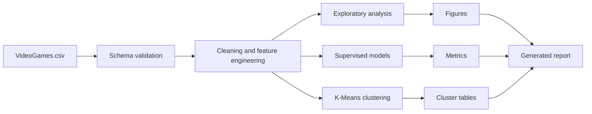

# Video Game Sales ML Analysis


[](LICENSE)

A reproducible machine-learning analysis of video game sales, review scores, genres and release periods. The project turns an original university group notebook into a reusable Python CLI that cleans the dataset, trains multiple models, generates visualisations and exports report-ready results.

## Key Results

The analysis uses **6,142 cleaned game records** from 1985–2016 and compares regression, classification, nearest-neighbour and clustering approaches.

| Model | Task | Test result |
| --- | --- | ---: |
| Linear regression | Predict global sales | R² = **0.173** |
| Linear regression | Predict critic score | R² = **0.457** |
| Logistic regression | Classify games above 0.6M sales | ROC-AUC = **0.628** |
| KNN regression | Predict global sales | R² = **0.336** |
| K-Means | Segment genre–decade profiles | Silhouette = **0.536** |

K-Means produced the clearest business interpretation. With `k=2`, it identified:

- a broad cluster of **31 genre–decade pairs** with moderate sales and review scores; and
- a smaller cluster of **6 high-performing pairs** with substantially stronger regional sales, critic scores and user scores.

The supervised results are deliberately reported as modest rather than overstated: the available genre, platform, year and review variables explain only part of the variation in commercial performance.

## Visual Overview

<table>
  <tr>
    <td width="50%">
      
      <br /><strong>Correlation structure</strong>
    </td>
    <td width="50%">
      
      <br /><strong>Average sales by decade</strong>
    </td>
  </tr>
  <tr>
    <td width="50%">
      
      <br /><strong>Genre–decade clusters</strong>
    </td>
    <td width="50%">
      
      <br /><strong>Hit-classification ROC curve</strong>
    </td>
  </tr>
</table>

## Analysis Pipeline



The pipeline:

1. validates the expected dataset schema;
2. converts numeric fields safely;
3. removes missing, duplicate and invalid sales records;
4. engineers log-sales, decade and categorical features;
5. trains and evaluates each model; and
6. exports figures, metrics, cluster assignments and a Markdown report.

## Modeling Approach

### Linear Regression

- Predicts log global sales from year, platform, genre and review information.
- Predicts critic score from game characteristics and user score.
- Includes train/test R², adjusted R² and RMSE outputs.

### Logistic Regression

- Converts sales prediction into a binary hit-classification task.
- Uses a configurable default threshold of **0.6 million global units**.
- Exports accuracy, ROC-AUC, the classification report and confusion matrix.

### K-Nearest Neighbours

- Estimates sales for a hypothetical game configuration.
- Returns both the prediction and the nearest historical games for interpretation.
- The default example predicts approximately **1.133 million units** for an Action title on PS4 with an 85 critic score and 8.2 user score.

### K-Means Clustering

- Aggregates performance by genre and decade.
- Compares candidate `k` values using silhouette scores and the elbow method.
- Exports both cluster-level summaries and individual genre–decade assignments.

## Installation

Clone the repository and create a virtual environment:

```bash
git clone https://github.com/hannnnnnnny/video-game-sales-ml-analysis.git
cd video-game-sales-ml-analysis
python -m venv .venv
```

Activate the environment on macOS or Linux:

```bash
source .venv/bin/activate
```

On Windows PowerShell:

```powershell
.venv\Scripts\Activate.ps1
```

Install the project:

```bash
pip install -e .
```

## Usage

Run the full analysis with the default dataset and settings:

```bash
vg-sales-analysis
```

The script can also be run directly:

```bash
python src/video_games_analysis.py
```

### Useful Options

```bash
# Choose the dataset and output directory
vg-sales-analysis --data data/VideoGames.csv --output-dir outputs

# Change the hit threshold and clustering configuration
vg-sales-analysis --hit-threshold 0.5 --k-values 2,3,4 --selected-k 3

# Score a custom example game with KNN
vg-sales-analysis \
  --example-genre Shooter \
  --example-platform PS4 \
  --example-critic-score 88 \
  --example-user-score 8.7
```

## Generated Outputs

| Path | Contents |
| --- | --- |
| `outputs/analysis_report.md` | Human-readable summary of the latest run |
| `outputs/model_metrics.json` | Structured configuration, dataset and model metrics |
| `outputs/cluster_summary_k2.csv` | Summary of the selected K-Means clusters |
| `outputs/genre_decade_clusters_k*.csv` | Genre–decade assignments for evaluated `k` values |
| `outputs/figures/` | EDA and model-performance visualisations |

## Dataset

The repository includes `data/VideoGames.csv` and its source description. The raw file contains **6,250 rows** and these main fields:

- `Name`, `Platform`, `Year_of_Release`, `Genre`
- `NA_Sales`, `EU_Sales`, `JP_Sales`, `Other_Sales`, `Global_Sales`
- `Critic_Score`, `User_Score`

After cleaning, the modeling dataset contains **6,142 rows**, **12 genres** and **17 platforms**.

## Project Structure

```text
video-game-sales-ml-analysis/
├── data/                 # Dataset and source description
├── notebooks/            # Adapted exploratory notebook
├── outputs/
│   ├── figures/          # Generated charts
│   ├── analysis_report.md
│   ├── model_metrics.json
│   └── *.csv             # Cluster summaries and assignments
├── reports/              # Original project report and notebook export
├── src/
│   └── video_games_analysis.py
├── pyproject.toml        # Package metadata and CLI entry point
├── requirements.txt
└── README.md
```

## Reproducibility Notes

- The adapted notebook uses the repository dataset path instead of a Google Colab path.
- The CLI accepts explicit data and output paths, allowing the analysis to run outside the original notebook environment.
- Random states are fixed in the modeling pipeline where applicable.
- Generated metrics and figures are committed so results can be reviewed without rerunning the analysis.

## Limitations

- The dataset ends in 2016 and should not be treated as a current market forecast.
- Sales are observational and historical; model relationships do not establish causation.
- Marketing spend, development budget, digital-only sales and release competition are not available.
- Platform and genre patterns may not transfer directly to newer distribution models or subscription services.
- The models are intended for analysis and learning, not production investment decisions.

## Original Project Materials

- [Adapted notebook](notebooks/Group_B02C_D_Final_Code.ipynb)
- [Generated analysis report](outputs/analysis_report.md)
- [Original group report](reports/Report_Project_Group_B02C-D.pdf)
- [Original notebook PDF](reports/Group_B02C_D_Final_Code.pdf)

## Licence

This project is licensed under the [MIT Licence](LICENSE).

---

Maintained by [Harry Han](https://github.com/hannnnnnnny).
