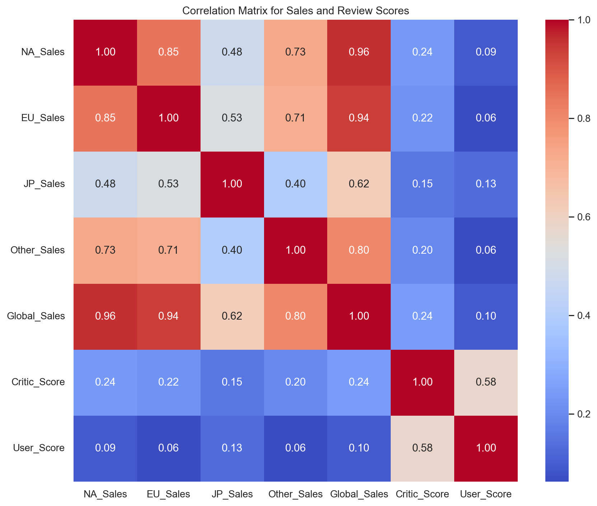
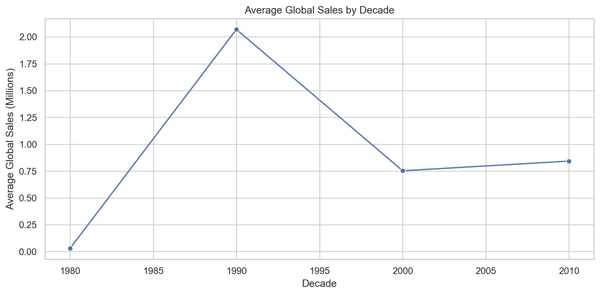
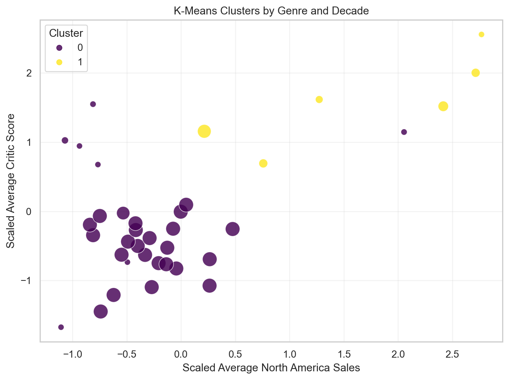
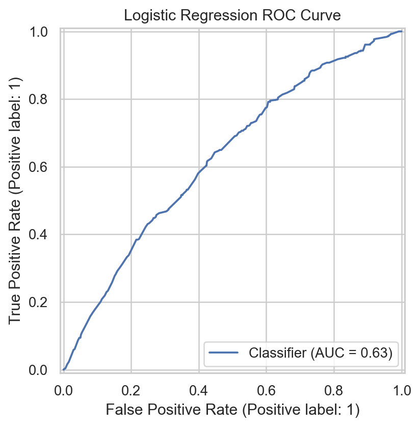

# Video Game Sales ML Analysis

This repository reproduces and upgrades a group project on video game sales
performance using `VideoGames.csv`. It is now structured as a reusable machine
learning analysis tool that can clean a compatible dataset, train the project
models, generate charts, and export metrics for reporting.

The main conclusion from the original report is that K-Means clustering by
genre and decade gives the clearest business insight: a small cluster of
1990s titles has stronger sales and review scores than the broader market,
suggesting that nostalgia-rich genres and established play styles can still be
valuable signals for publishers.

## What Is Included

- A reusable analysis CLI: `src/video_games_analysis.py`
- The adapted notebook: `notebooks/Group_B02C_D_Final_Code.ipynb`
- The dataset and source description: `data/VideoGames.csv`, `data/VideoGames.txt`
- The final project report: `reports/Report_Project_Group_B02C-D.pdf`
- Generated charts, metrics, cluster tables, and a Markdown report in `outputs/`

## Quick Start

```bash
python -m venv .venv
.venv\Scripts\activate
pip install -e .
vg-sales-analysis
```

On macOS or Linux, activate the environment with:

```bash
source .venv/bin/activate
```

You can also run the script directly:

```bash
python src/video_games_analysis.py
```

The tool writes figures to `outputs/figures/`, model metrics to
`outputs/model_metrics.json`, K-Means cluster tables to `outputs/*.csv`, and a
readable report to `outputs/analysis_report.md`.

Useful CLI options:

```bash
vg-sales-analysis --data data/VideoGames.csv --output-dir outputs
vg-sales-analysis --hit-threshold 0.5 --k-values 2,3,4 --selected-k 3
vg-sales-analysis --example-genre Shooter --example-platform PS4 --example-critic-score 88 --example-user-score 8.7
```

## Dataset

The dataset contains 6,250 video game records from 1985 to 2016. After dropping
missing values, duplicates, and invalid sales rows, the reproducible script uses
6,142 rows for modeling.

Main fields:

- `Name`, `Platform`, `Year_of_Release`, `Genre`
- `NA_Sales`, `EU_Sales`, `JP_Sales`, `Other_Sales`, `Global_Sales`
- `Critic_Score`, `User_Score`

## Visual Overview

The correlation matrix shows that regional sales are strongly related to global
sales, while critic and user scores have weaker direct linear relationships.



Average global sales peak in the 1990s, which is why the final clustering model
adds a decade feature.



K-Means clustering separates genre-decade profiles into a broad moderate cluster
and a smaller high-performing cluster with stronger North American sales and
critic scores.



The logistic regression model reframes the task as hit prediction, but it is less
useful than clustering because the available variables do not capture enough of
the market variance.



## Modeling Approach

The reusable pipeline validates the expected dataset schema, converts numeric
columns safely, removes incomplete or invalid rows, and reruns the main
approaches from the original notebook:

- Linear regression for log global sales prediction.
- Linear regression for critic score prediction.
- Logistic regression for hit classification using a 0.6 million global-sales threshold.
- KNN regression for example game sales prediction.
- K-Means clustering on genre-decade profiles, using regional sales and review scores.

The default clustering setup uses `k=2`, matching the strongest silhouette score
in the project report. The `--k-values` and `--selected-k` options make this easy
to change for future experiments.

## Repository Structure

```text
.
├── data/
│   ├── VideoGames.csv
│   └── VideoGames.txt
├── notebooks/
│   └── Group_B02C_D_Final_Code.ipynb
├── outputs/
│   ├── figures/
│   ├── cluster_summary_k2.csv
│   ├── genre_decade_clusters_k2.csv
│   ├── genre_decade_clusters_k3.csv
│   ├── analysis_report.md
│   └── model_metrics.json
├── reports/
│   ├── Group_B02C_D_Final_Code.pdf
│   └── Report_Project_Group_B02C-D.pdf
├── src/
│   └── video_games_analysis.py
├── .gitignore
├── README.md
└── requirements.txt
```

## Notes

The notebook was adapted from the original Google Colab version so it uses the
local repository dataset path instead of `/content/VideoGames (1).csv`.
